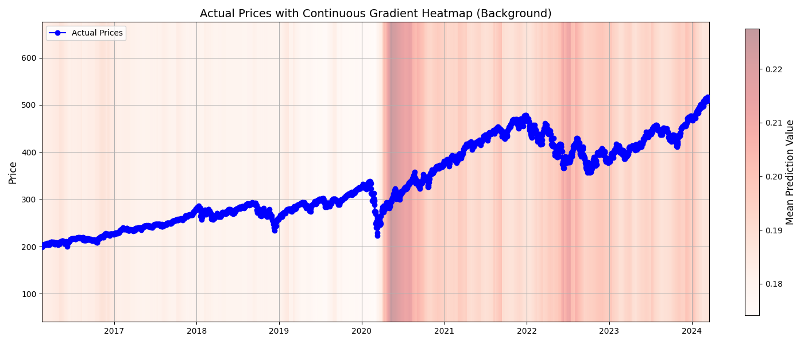

# Model Train & Evaluation & Backtest

## Model Info

### Features

모델은 다음과 같은 입력 변수를 사용 (`INPUT_VAR`):

- **FEDFUNDS**: 연방 기금 금리 - 경제 활동에 영향을 미치는 주요 금리
- **Close**: 주식 종가 - 당일 거래의 마지막 가격
- **CPIAUCNS**: 소비자물가지수 - 인플레이션 지표
- **Volume**: 거래량 - 주식의 유동성을 나타냄
- **UNRATE**: 실업률 - 고용 시장의 건강 상태를 반영
- **GDPC1**: 실질 GDP - 총 경제 생산량을 측정
- **UMCSENT**: 소비자 신뢰 지수 - 소비자의 경제적 심리를 반영
- **DGS10**: 10년 만기 국채 금리 - 금리의 주요 벤치마크
- **HOUST**: 신규 주택 착공 건수 - 주택 시장의 경제 상태를 나타냄
- **ISRATIO**: 재고 대비 판매 비율 - 비즈니스 효율성과 경제 동향을 측정
- **TWEXB**: 무역 가중치 달러 지수 - 미국 달러의 상대적 강도
- **PI**: 개인 소득 - 소득 수준의 변화를 추적

일부 데이터는 스케일링하여 사용

### Output

- **타겟 변수**: 중·단기 주식 수익률
  - 타겟 변수는 예측 기간(예: 30일) 동안의 주가 변동성
  - 미래의 가격 변화 추세와 모멘텀을 예측하기 위한 지표

## Model Architecture

### Transformer 기반 시계열 모델

- **입력 크기**: 12개 feature
- **모델 구성**:
  - **임베딩 차원 (`d_model`)**: 256
  - **멀티헤드 어텐션 (`nhead`)**: 16
  - **레이어 수 (`num_layers`)**: 16
  - **출력 차원**: 1 (예측된 수익률)
- **손실 함수**:
  - **HuberLoss**: 이상치 반영을 위한 손실 함수
  - **Custom Regularization**: 학습 안정성과 일반화를 강화

## 모델 학습

### 학습 구성

- **시퀀스 길이 (`n_steps`)**: 30일의 과거 데이터
- **예측 기간 (`forecast_steps`)**: 30일
- **배치 크기 (`batch_size`)**: 64
- **학습률 (`lr`)**: 0.00000001 (학습률 스케줄러 사용 가능)
- **조기 종료 (Early Stopping)**: 3 에포크 동안 개선되지 않을 경우 학습 중단

## 모델 평가

## 백테스트

### 백테스트 구성

`TODO`
- 모델은 과거 데이터를 기반으로 Buy/Sell 신호를 예측하여 성능을 평가합니다
- **입력**: 30일 간의 과거 데이터
- **출력**: 예측된 수익률 및 신호 (Buy, Sell, Hold)
- **신호 기준** T
  
### 백테스트 결과 

`TODO`

- **평가 지표**:
  - 총 포트폴리오 수익률
  - 샤프 비율 (Sharpe Ratio)
  - 최대 낙폭 (Maximum Drawdown)
- **시각화**:
  - Buy/Sell 신호가 표시된 가격 추이
  - 시간에 따른 예측 벡터 분포(히트맵)

## 배포

### MLflow 통합

- **실험 관리**:
  - 모든 실행, 파라미터, 메트릭을 MLflow에 기록
- **모델 레지스트리**:
  - 학습된 모델은 MLflow 모델 레지스트리에 저장하여 재현성과 배포 용이성 제공
